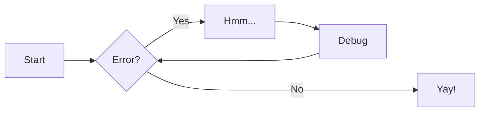

# デモページ

## 1. AAAAAAAAAAAAAA

{ align=left }

Lorem ipsum dolor sit, amet consectetur adipisicing elit. Sapiente quibusdam tenetur odio officia debitis consectetur eligendi odit minus ut. Corrupti rem vero, ab tempora earum officiis maxime ea nostrum reprehenderit! Lorem ipsum dolor sit, amet consectetur adipisicing elit. Sapiente quibusdam tenetur odio officia debitis consectetur eligendi odit minus ut. Corrupti rem vero, ab tempora earum officiis maxime ea nostrum reprehenderit! Lorem ipsum dolor sit, amet consectetur adipisicing elit. Sapiente quibusdam tenetur odio officia debitis consectetur eligendi odit minus ut. Corrupti rem vero, ab tempora earum officiis maxime ea nostrum reprehenderit! Lorem ipsum dolor sit, amet consectetur adipisicing elit. Sapiente quibusdam tenetur odio officia debitis consectetur eligendi odit minus ut. Corrupti rem vero, ab tempora earum officiis maxime ea nostrum reprehenderit!

## 2. BBBBB

{ align=right }

Lorem ipsum dolor sit, amet consectetur adipisicing elit. Sapiente quibusdam tenetur odio officia debitis consectetur eligendi odit minus ut. Corrupti rem vero, ab tempora earum officiis maxime ea nostrum reprehenderit! Lorem ipsum dolor sit, amet consectetur adipisicing elit. Sapiente quibusdam tenetur odio officia debitis consectetur eligendi odit minus ut. Corrupti rem vero, ab tempora earum officiis maxime ea nostrum reprehenderit! Lorem ipsum dolor sit, amet consectetur adipisicing elit. Sapiente quibusdam tenetur odio officia debitis consectetur eligendi odit minus ut. Corrupti rem vero, ab tempora earum officiis maxime ea nostrum reprehenderit! Lorem ipsum dolor sit, amet consectetur adipisicing elit. Sapiente quibusdam tenetur odio officia debitis consectetur eligendi odit minus ut. Corrupti rem vero, ab tempora earum officiis maxime ea nostrum reprehenderit!

## 3. CCCCCCCCCCCCCCCCCCCCC

Lorem ipsum dolor sit, amet consectetur adipisicing elit. Sapiente quibusdam tenetur odio officia debitis consectetur eligendi odit minus ut. Corrupti rem vero, ab tempora earum officiis maxime ea nostrum reprehenderit! Lorem ipsum dolor sit, amet consectetur adipisicing elit. Sapiente quibusdam tenetur odio officia debitis consectetur eligendi odit minus ut. Corrupti rem vero, ab tempora earum officiis maxime ea nostrum reprehenderit! Lorem ipsum dolor sit, amet consectetur adipisicing elit. Sapiente quibusdam tenetur odio officia debitis consectetur eligendi odit minus ut. Corrupti rem vero, ab tempora earum officiis maxime ea nostrum reprehenderit! Lorem ipsum dolor sit, amet consectetur adipisicing elit. Sapiente quibusdam tenetur odio officia debitis consectetur eligendi odit minus ut. Corrupti rem vero, ab tempora earum officiis maxime ea nostrum reprehenderit!

## 4. DDDDDDDDDDDDDDDDDDD

Lorem ipsum dolor sit, amet consectetur adipisicing elit. Sapiente quibusdam tenetur odio officia debitis consectetur eligendi odit minus ut. Corrupti rem vero, ab tempora earum officiis maxime ea nostrum reprehenderit! Lorem ipsum dolor sit, amet consectetur adipisicing elit. Sapiente quibusdam tenetur odio officia debitis consectetur eligendi odit minus ut. Corrupti rem vero, ab tempora earum officiis maxime ea nostrum reprehenderit! Lorem ipsum dolor sit, amet consectetur adipisicing elit. Sapiente quibusdam tenetur odio officia debitis consectetur eligendi odit minus ut. Corrupti rem vero, ab tempora earum officiis maxime ea nostrum reprehenderit! Lorem ipsum dolor sit, amet consectetur adipisicing elit. Sapiente quibusdam tenetur odio officia debitis consectetur eligendi odit minus ut. Corrupti rem vero, ab tempora earum officiis maxime ea nostrum reprehenderit!

## 5. EEEEEEE

Lorem ipsum dolor sit, amet consectetur adipisicing elit. Sapiente quibusdam tenetur odio officia debitis consectetur eligendi odit minus ut. Corrupti rem vero, ab tempora earum officiis maxime ea nostrum reprehenderit! Lorem ipsum dolor sit, amet consectetur adipisicing elit. Sapiente quibusdam tenetur odio officia debitis consectetur eligendi odit minus ut. Corrupti rem vero, ab tempora earum officiis maxime ea nostrum reprehenderit! Lorem ipsum dolor sit, amet consectetur adipisicing elit. Sapiente quibusdam tenetur odio officia debitis consectetur eligendi odit minus ut. Corrupti rem vero, ab tempora earum officiis maxime ea nostrum reprehenderit! Lorem ipsum dolor sit, amet consectetur adipisicing elit. Sapiente quibusdam tenetur odio officia debitis consectetur eligendi odit minus ut. Corrupti rem vero, ab tempora earum officiis maxime ea nostrum reprehenderit!

## Python Markdown

### 略語

The HTML specification is maintained by the W3C.

*[HTML]: Hyper Text Markup Language
*[W3C]: World Wide Web Consortium

``` yaml title="mkdocs.yml"
markdown_extensions:
  - abbr
```

``` md
The HTML specification is maintained by the W3C.

*[HTML]: Hyper Text Markup Language
*[W3C]: World Wide Web Consortium
```

### コールアウト

!!! note "Phasellus posuere in sem ut cursus"

    Lorem ipsum dolor sit amet, consectetur adipiscing elit. Nulla et euismod
    nulla. Curabitur feugiat, tortor non consequat finibus, justo purus auctor
    massa, nec semper lorem quam in massa.

``` yaml title="mkdocs.yml"
markdown_extensions:
  - admonition
```

``` md
!!! note "Phasellus posuere in sem ut cursus"

    Lorem ipsum dolor sit amet, consectetur adipiscing elit. Nulla et euismod
    nulla. Curabitur feugiat, tortor non consequat finibus, justo purus auctor
    massa, nec semper lorem quam in massa.
```

#### abstract

!!! abstract "Phasellus posuere in sem ut cursus"

    Lorem ipsum dolor sit amet, consectetur adipiscing elit. Nulla et euismod
    nulla. Curabitur feugiat, tortor non consequat finibus, justo purus auctor
    massa, nec semper lorem quam in massa.

``` md
!!! abstract "Phasellus posuere in sem ut cursus"

    Lorem ipsum dolor sit amet, consectetur adipiscing elit. Nulla et euismod
    nulla. Curabitur feugiat, tortor non consequat finibus, justo purus auctor
    massa, nec semper lorem quam in massa.
```

### 定義リスト

`Lorem ipsum dolor sit amet`

:   Sed sagittis eleifend rutrum. Donec vitae suscipit est. Nullam tempus
    tellus non sem sollicitudin, quis rutrum leo facilisis.

`Cras arcu libero`

:   Aliquam metus eros, pretium sed nulla venenatis, faucibus auctor ex. Proin
    ut eros sed sapien ullamcorper consequat. Nunc ligula ante.

    Duis mollis est eget nibh volutpat, fermentum aliquet dui mollis.
    Nam vulputate tincidunt fringilla.
    Nullam dignissim ultrices urna non auctor.

``` yaml title="mkdocs.yml"
markdown_extensions:
  - def_list
```

``` md
`Lorem ipsum dolor sit amet`

:   Sed sagittis eleifend rutrum. Donec vitae suscipit est. Nullam tempus
    tellus non sem sollicitudin, quis rutrum leo facilisis.

`Cras arcu libero`

:   Aliquam metus eros, pretium sed nulla venenatis, faucibus auctor ex. Proin
    ut eros sed sapien ullamcorper consequat. Nunc ligula ante.

    Duis mollis est eget nibh volutpat, fermentum aliquet dui mollis.
    Nam vulputate tincidunt fringilla.
    Nullam dignissim ultrices urna non auctor.
```

### 脚注

Lorem ipsum[^1] dolor sit amet, consectetur adipiscing elit.[^2]

[^1]: Lorem ipsum dolor sit amet, consectetur adipiscing elit.

[^2]:
    Lorem ipsum dolor sit amet, consectetur adipiscing elit. Nulla et euismod
    nulla. Curabitur feugiat, tortor non consequat finibus, justo purus auctor
    massa, nec semper lorem quam in massa.

``` yaml title="mkdocs.yml"
markdown_extensions:
  - footnotes
```

``` md
Lorem ipsum[^1] dolor sit amet, consectetur adipiscing elit.[^2]

[^1]: Lorem ipsum dolor sit amet, consectetur adipiscing elit.

[^2]:
    Lorem ipsum dolor sit amet, consectetur adipiscing elit. Nulla et euismod
    nulla. Curabitur feugiat, tortor non consequat finibus, justo purus auctor
    massa, nec semper lorem quam in massa.
```

### Markdown in HTML

<div style="color: red" markdown>
- HTMLの中にマークダウンを書くことができます
- HTMLの属性に `markdown` を書く必要があります
</div>

``` yaml title="mkdocs.yml"
markdown_extensions:
  - md_in_html
```

``` md
<div style="color: red" markdown>
- HTMLの中にマークダウンを書くことができます
- HTMLの属性に `markdown` を書く必要があります
</div>
```

## Python Markdown Extensions

### 上付き

- y = x^2^
- y = x^Python\ Markdown\ Extensions^

``` yaml title="mkdocs.yml"
markdown_extensions:
  - pymdownx.caret
```

``` md
- y = x^2^
- y = x^Python\ Markdown\ Extensions^
```

### 下付き

- a~0~
- a~Python\ Markdown\ Extensions~

``` yaml title="mkdocs.yml"
markdown_extensions:
  - pymdownx.tilde
```

``` md
- a~0~
- a~Python\ Markdown\ Extensions~
```

### 下線

^^Insert me^^

``` yaml title="mkdocs.yml"
markdown_extensions:
  - pymdownx.caret
```

``` md
^^Insert me^^
```

### マーク

- ==mark me==
- ==smart==mark==

``` yaml title="mkdocs.yml"
markdown_extensions:
  - pymdownx.mark
```

``` md
- ==mark me==
- ==smart==mark==
```

### 打消し線

~~Delete me~~

``` yaml title="mkdocs.yml"
markdown_extensions:
  - pymdownx.tilde
```

``` md
~~Delete me~~
```

### 詳細

??? note
    Here's some content.

???+ note
    Here's some content.

!!! note
    Here's some content.

``` yaml title="mkdocs.yml"
markdown_extensions:
  - pymdownx.details
```

``` md
??? note
    Here's some content.

???+ note
    Here's some content.

!!! note
    Here's some content.
```

### ハイライト

``` c title="main.c"
int main(void)
{
    return 0;
}
```

``` yaml title="mkdocs.yml"
markdown_extensions:
  - pymdownx.superfences
  - pymdownx.highlight:
      use_pygments: true
      pygments_lang_class: true
      auto_title: true
      linenums: true
      linenums_style: table
      anchor_linenums: true
```

```` md
``` c title="main.c"
int main(void)
{
    return 0;
}
```
````

### コードフェンス

#### カスタムコードフェンス



``` yaml title="mkdocs.yml"
markdown_extensions:
- pymdownx.superfences:
    custom_fences:
        - name: mermaid
        class: mermaid
        format: !!python/name:pymdownx.superfences.fence_code_format
```

```` md

````

### タブ

=== "C"

    ``` c
    #include <stdio.h>

    int main(void) {
      printf("Hello world!\n");
      return 0;
    }
    ```

=== "C++"

    ``` c++
    #include <iostream>

    int main(void) {
      std::cout << "Hello world!" << std::endl;
      return 0;
    }
    ```

``` yaml title="mkdocs.yml"
markdown_extensions:
  - pymdownx.superfences
  - pymdownx.tabbed:
      alternate_style: true

```

```` md
=== "C"

    ``` c
    #include <stdio.h>

    int main(void) {
      printf("Hello world!\n");
      return 0;
    }
    ```

=== "C++"

    ``` c++
    #include <iostream>

    int main(void) {
      std::cout << "Hello world!" << std::endl;
      return 0;
    }
    ```
````

## グリッド

<div class="grid cards" markdown>

- :fontawesome-brands-html5: __HTML__ for content and structure
- :fontawesome-brands-js: __JavaScript__ for interactivity
- :fontawesome-brands-css3: __CSS__ for text running out of boxes
- :fontawesome-brands-internet-explorer: __Internet Explorer__ ... huh?

</div>

``` md
<div class="grid cards" markdown>

- :fontawesome-brands-html5: __HTML__ for content and structure
- :fontawesome-brands-js: __JavaScript__ for interactivity
- :fontawesome-brands-css3: __CSS__ for text running out of boxes
- :fontawesome-brands-internet-explorer: __Internet Explorer__ ... huh?

</div>
```
